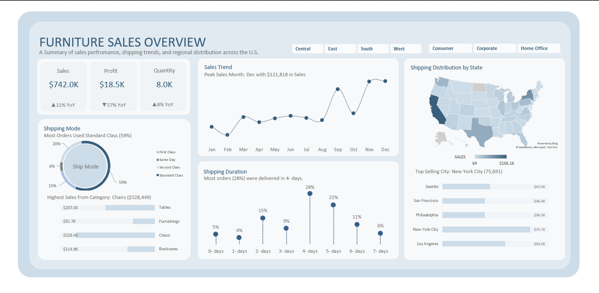

# 🪑 Furniture Sales Analysis Dashboard | Microsoft Excel  

This project presents a complete **Furniture Sales Analysis Dashboard** built using **Microsoft Excel**, designed to analyze sales performance, customer demand, product categories, and shipping efficiency. It transforms raw sales data into an **interactive, visually appealing, and insight-driven dashboard** for business decision-making.  

---

## 📊 Project Overview  

The goal of this project is to convert a large furniture sales dataset into a **dynamic Excel dashboard** that allows managers and analysts to track performance, monitor trends, and identify top-selling products and cities. The dashboard provides a holistic view of sales, profit, and shipping behavior across different regions.  

---

## 🧠 Business Objectives  

- Analyze **total sales, profit, and quantity sold** across regions and time periods  
- Identify **top-performing cities and product categories**  
- Track **year-over-year (YoY)** growth in key KPIs  
- Evaluate **shipping performance and duration**  
- Provide a **visual summary** of sales distribution by category and region  

---

## 🗂️ Data Model  

| Type | File Name | Description |
|------|------------|-------------|
| **Fact** | `Furniture_Sales.csv` | Contains order details such as date, sales, profit, and quantity |
| **Dashboard** | `Furniture SalesDashboa.xlsx` | Contains interactive charts, KPIs, and region filters |

📦 **Note:**  
The raw dataset was imported and transformed using **Power Query** for cleaning and preprocessing.  
Then, **Pivot Tables** and **Pivot Charts** were used to build the final interactive dashboard.

---

## ⚙️ Tools & Techniques Used  

| Tool | Purpose |
|------|----------|
| **Microsoft Excel** | Dashboard creation, visualization, and KPI tracking |
| **Power Query** | Data cleaning, transformation, and model preparation |
| **Pivot Tables** | Data aggregation and dynamic analysis |
| **Pivot Charts** | Line, bar, and donut charts for visual storytelling |
| **Conditional Formatting** | Highlighting key metrics and YoY changes |
| **Data Modeling** | Linking cleaned tables to create interactive visuals |

---

## 💡 Key Insights  

- 💰 **Total Sales:** \$391K with a **7% YoY increase**  
- 📈 **Total Profit:** \$7K with a **55% YoY decline**  
- 📦 **Quantity Sold:** 4.2K units, up **10% YoY**  
- 🚚 **Most Common Ship Mode:** Standard Class (**58%** of total orders)  
- 🏙️ **Top City:** New York City (**\$49,519** sales)  
- 📅 **Peak Sales Month:** December (**\$67,637** in sales)  
- ⏱️ **Fastest Delivery Duration:** 4 days (28% of orders)  

---

## 🔷 Excel Dashboard Preview  

### **📍 Dashboard Overview Page**  
📊 Displays all major KPIs — Total Sales, Profit, and Quantity with YoY comparisons.  
📈 Includes visuals for sales trends, shipping modes, top cities, and regional analysis.  

  

---

## 📈 Insights Gained  

- Clear understanding of sales and profitability across multiple dimensions  
- Identification of best-performing product categories and shipping patterns  
- Recognition of top cities and customer segments contributing to revenue  
- Simplified reporting with interactive filters and dynamic visuals  
- Improved visibility into operational performance using **Excel + Power Query**  

---

## 📬 Contact  

**👤 Santhosh Babu S**  
🎯 *Data Analyst | Excel | Power BI | SQL | Python*  

📧 **Email:** [santhoshbabus.analyst@gmail.com](mailto:santhoshbabus.analyst@gmail.com)  
🔗 [**LinkedIn**](https://www.linkedin.com/in/santhoshbabus/) | [**GitHub**](https://github.com/santhoshbabu-analyst)  

---

⭐ *If you found this project helpful, don’t forget to star this repository!* ⭐
